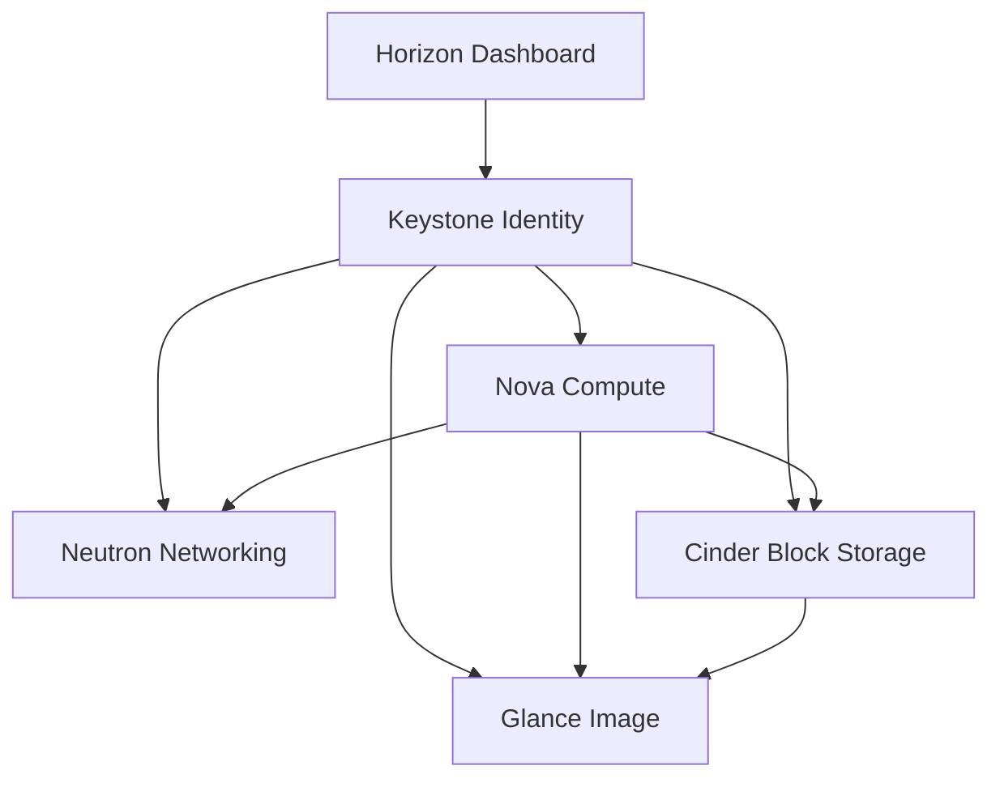

# OpenStack Architecture

Overview of how OpenStack services interconnect.

## Service Topology

## Core Concepts

- **Projects & Users** — Multi-tenancy via Keystone domains, projects, and roles
- **Regions & AZs** — Physical isolation and failure domains
- **Cells** — Nova scaling unit for large deployments
- **API Endpoints** — Each service exposes a REST API registered in Keystone's catalog
